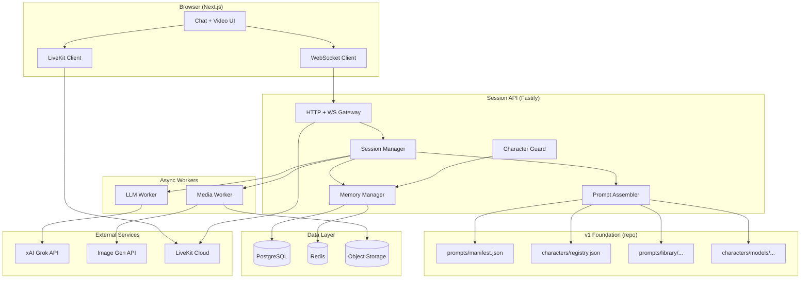
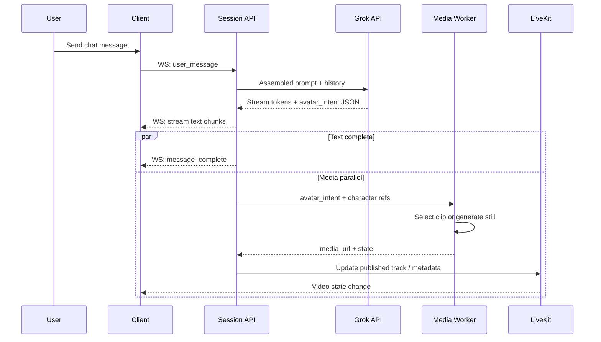

# Procharacters.cloud v2 — Technical Architecture (Live MVP)

**Status:** Draft (June 25, 2026)  
**Audience:** Gary + development team  
**Scope:** v2.0 MVP — first live text chat + video experience  
**Builds on:** v1 foundation (`prompts/`, `characters/`, `scripts/`)

---

## Business goal (plain language)

Ship a working live session where a user can **text chat with one Naughty Syntax character** and **see a reactive on-screen avatar/video** that stays in character. v2.0 proves the core loop; v2.1 adds model switching and custom characters.

---

## v2.0 MVP boundaries

| In scope (v2.0) | Out of scope (defer) |
|-----------------|----------------------|
| Live text chat with one default character (Twink or Female — pick one for launch) | Full user accounts / billing |
| Simple reactive video/avatar display | v3 edging/gooning real-time assistant |
| Session memory (within one session only) | Persistent memory across sessions |
| Prompt-driven character consistency | Multi-character sessions |
| Anonymous or lightweight session access (magic link or temp token) | Complex onboarding / social features |

Everything below is designed so v2.1 can add the second default model, switching, and basic custom characters **without rewriting the core**.

---

## Recommended tech stack

Practical choices optimized for **speed to MVP**, not maximum scale on day one.

### Frontend

| Layer | Choice | Why |
|-------|--------|-----|
| Framework | **Next.js 15 (App Router) + TypeScript** | Fast to ship a public web app; good WebSocket/WebRTC client support; easy Vercel deploy for UI |
| Styling | **Tailwind CSS** | Matches rapid iteration; consistent premium adult UI |
| State | **Zustand** (session + UI) | Lightweight; keeps chat/video state simple |

### Backend

| Layer | Choice | Why |
|-------|--------|-----|
| API | **Node.js + Fastify** (TypeScript) | Low-latency HTTP + WebSocket; same language as frontend |
| Real-time | **WebSockets** (native `ws` or Socket.io) | Chat events, typing, avatar state updates, session lifecycle |
| Video transport | **LiveKit Cloud** (managed WebRTC) | Avoids building TURN/STUN/ICE from scratch; scales when needed |
| Primary DB | **PostgreSQL** (Supabase or Neon) | Sessions, transcripts, character config snapshots |
| Hot session state | **Redis** (Upstash) | Active memory, rate limits, pub/sub between API workers |
| Object storage | **S3-compatible** (R2 / S3) | Generated images, short video clips, avatar assets |

### AI / media

| Layer | Choice | Why |
|-------|--------|-----|
| Chat LLM | **xAI Grok API** (or equivalent uncensored-capable model) | Aligns with Naughty Syntax uncensored requirement; strong instruction-following |
| Image refresh | **Flux / SDXL-class image API** | Near-real-time still updates (1–4s) beat true generative video for MVP |
| Video MVP | **Pre-rendered base loop + state-triggered image swaps** | True real-time AI video is too slow/expensive for v2.0; fake continuity with smart UX |

### Infra & ops

| Layer | Choice | Why |
|-------|--------|-----|
| Hosting | **Vercel** (frontend) + **Fly.io or Railway** (API) | Simple deploy path; upgrade later |
| Secrets | **Doppler or platform env vars** | API keys for LLM, image, LiveKit |
| Observability | **Sentry + basic structured logs** | Debug character breaks and latency spikes early |

### What we are *not* recommending for v2.0

- Self-hosted WebRTC (too much ops overhead)
- Full microservices split (one API service + workers is enough)
- True real-time generative video as the core loop (quality/latency/cost risk)
- Building a custom LLM fine-tune before the prompt pipeline is proven

---

## System architecture (high level)



### Service responsibilities

1. **Session API** — owns session lifecycle, auth token, WebSocket rooms, orchestration.
2. **Prompt Assembler** — loads v1 files, pins versions, builds the LLM context for each turn.
3. **Memory Manager** — stores messages, rolling summary, avatar state per session.
4. **LLM Worker** — calls Grok; returns text + structured `avatar_intent` (pose, emotion, action tags).
5. **Media Worker** — turns `avatar_intent` + character `model.json` appearance into image updates or clip swaps.
6. **Character Guard** — lightweight post-check that response stayed on-brand before sending to client.

---

## Real-time chat + video — how it works

### Session lifecycle

```
1. User opens session URL (anonymous token or magic link)
2. API creates session_id, loads character from registry (e.g. twink-default @ v1.2.0)
3. Prompt Assembler builds initial system prompt (system-core + character prompt + model.json summary)
4. Client connects WebSocket + joins LiveKit room
5. API streams opening message + initial avatar state (base loop already playing)
6. User sends message → orchestration pipeline runs → text + visual update pushed to client
7. Session ends (timeout, user leave, or explicit end) → transcript persisted, Redis cleared
```

### Chat path (target: under 2–3 seconds)

```
User message
  → WebSocket → Session API
  → Memory Manager fetches: summary + last N messages
  → Prompt Assembler builds full prompt
  → LLM Worker (streaming tokens to client for perceived speed)
  → Character Guard (optional fast regex/mini-LLM check)
  → Persist assistant message + update summary if threshold hit
  → Emit avatar_intent to Media Worker (parallel, non-blocking for text)
  → Client renders streaming text immediately; video updates when media ready
```

**Key UX rule:** Never block chat text on image/video generation. Text streams first; visuals catch up.

### Video path (v2.0 pragmatic approach)

True generative video per message is not viable for MVP. Use a **state-driven avatar system**:

| Component | v2.0 behavior |
|-----------|---------------|
| **Base layer** | 5–10 second seamless loop per character (pre-rendered or high-quality generated once): neutral tease, idle breathing, subtle movement |
| **State layer** | On each LLM turn, parse `avatar_intent`: `{ emotion, pose, action, arousal_level, clothing_state }` |
| **Visual update** | Map intent → nearest pre-made clip **or** generate a still image (1–4s) and crossfade over the loop |
| **Delivery** | LiveKit publishes a single video track (loop + overlay/crossfade); client never manages raw WebRTC signaling |



### v2.1 extension (no rewrite)

- Add `character_id` to session create → same pipeline, different prompt bundle.
- Clip library grows per character; registry drives which assets load.

---

## Character prompts during live sessions

v1 already stores the source of truth. v2 **reads** it; it does not fork prompt logic into hardcoded strings.

### Prompt stack (assembled per turn)

```
┌─────────────────────────────────────────┐
│ 1. system-core (platform rules, brand)  │
├─────────────────────────────────────────┤
│ 2. character prompt (e.g. twink v1.2.0) │
├─────────────────────────────────────────┤
│ 3. model.json summary (appearance JSON)   │
├─────────────────────────────────────────┤
│ 4. session summary (compressed memory)  │
├─────────────────────────────────────────┤
│ 5. last N messages (sliding window)     │
├─────────────────────────────────────────┤
│ 6. live instructions (response format)    │
└─────────────────────────────────────────┘
```

### Load rules

| Rule | Detail |
|------|--------|
| **Version pin** | On `session.start`, snapshot `prompt_version` + `character_version` into DB. Session keeps that version even if manifest updates mid-flight. |
| **Source files** | `prompts/manifest.json` → path → `prompts/library/.../*.md`; `characters/registry.json` → `model.json` |
| **Retrieval** | Port v1 `scripts/prompt_get.py` logic into API module `lib/prompts/load.ts` (or call Python as subprocess short-term) |
| **Structured output** | Append live-only suffix requiring JSON tail: `{ "reply": "...", "avatar_intent": { ... } }` |
| **Image consistency** | Media Worker injects `model.json` appearance fields + last good frame as reference for image API |

### Character switch (v2.1)

Mid-session switch is **out of v2.0**. When added: end current character context, inject switch preamble, reset avatar state machine, keep session summary but note character change in summary block.

### Anti-drift tactics

- Pin prompt version per session
- Repeat 3–5 line **appearance anchor** in every assembled prompt (from `model.json`)
- Character Guard rejects responses that drop signature traits (sheer clothing, edging energy, etc.) and triggers one silent retry
- Log drift incidents to improve prompts — do not over-engineer automated correction in v2.0

---

## Session memory approach

v2.0 = **session-scoped only**. No long-term user memory.

### Three layers

| Layer | Storage | Purpose | TTL |
|-------|---------|---------|-----|
| **Hot window** | Redis list | Last 20–30 message pairs for LLM context | Session |
| **Running summary** | Redis string + PG row | Compressed narrative: user prefs, scene, arousal arc, key phrases | Session |
| **Avatar state** | Redis hash | Current `avatar_intent`, last media URL, loop id | Session |

### Summary refresh strategy

- Start with empty summary
- Every **8–10 turns** (or when context token estimate exceeds ~6K), run a **cheap summarization call**:
  - Input: previous summary + new messages
  - Output: updated summary (max ~500 tokens)
- Store summary in Redis for speed; flush to PostgreSQL on session end

### What memory should capture

- Scene setting and user-stated preferences
- Emotional/erotic arc (tease level, edging state)
- Names and explicit details the user introduced
- **Not** full verbatim logs in the summary (keep those in `messages` table)

### PostgreSQL schema (minimal)

```
sessions(id, character_id, prompt_version, created_at, ended_at)
messages(id, session_id, role, content, created_at)
session_summaries(session_id, summary, updated_at)
session_snapshots(session_id, prompt_bundle_hash, model_json, created_at)
```

### v2.2+ path

Add `user_id` + `user_memory` table when accounts ship. Session summary merges into long-term profile — same summarization pattern, different TTL.

---

## API & WebSocket contract (MVP sketch)

### REST

| Endpoint | Purpose |
|----------|---------|
| `POST /sessions` | Create session `{ character_id }` → `{ session_id, ws_token, livekit_token }` |
| `GET /sessions/:id` | Session metadata + character info |
| `POST /sessions/:id/end` | Graceful teardown |

### WebSocket events

| Client → Server | Server → Client |
|-----------------|-----------------|
| `user_message` | `assistant_stream` (token chunks) |
| `ping` | `assistant_complete` |
| `end_session` | `avatar_update` |
| | `error` |
| | `session_ended` |

---

## Major technical risks

| Risk | Severity | Mitigation |
|------|----------|------------|
| **Latency stack-up** (LLM + image + video) | High | Stream text first; parallel media; cap image gen to 1 per turn; clip library for common intents |
| **Character drift / breaks persona** | High | Version-pinned prompts; appearance anchor; Character Guard + single retry; session logging for prompt fixes |
| **Fake video feels cheap** | Medium | Invest in 3–5 high-quality base loops per character; smooth crossfades; still images only for key moments |
| **NSFW API / hosting ToS** | High | Confirm Grok + image provider + CDN allow explicit content; age gate + consent copy; avoid mainstream restrictive hosts for media |
| **Cost per session** | Medium | Token budgets per session; summarize aggressively; cache common avatar states; session time limits in v2.0 |
| **WebRTC complexity** | Medium | Use LiveKit managed service; one publisher (server-side compositor), many subscribers |
| **Concurrent session scale** | Low (early) | Redis + stateless API workers; queue LLM calls; load test at 10 → 50 → 100 sessions |
| **Prompt manifest drift** | Medium | Session snapshot at start; integration test that manifest paths resolve |
| **Security (anonymous sessions)** | Medium | Short-lived tokens; rate limit by IP; no PII required for v2.0; audit logs |
| **Scope creep into v3 assistant** | Medium | Hard gate: no proactive edging automation in v2.0 — reactive only |

---

## Suggested build order

1. **Prompt Assembler service** — load v1 files, produce assembled prompt in API (proves foundation integration)
2. **Chat-only prototype** — WebSocket + Grok streaming, no video
3. **Session memory** — Redis window + summarization + PG persistence
4. **Avatar state machine** — structured `avatar_intent` from LLM
5. **Base video loop + LiveKit** — one character, clip crossfade
6. **Image gen hook** — optional still refresh for key intents
7. **Hardening** — rate limits, error UX, character break logging

Target: steps 1–5 = shippable v2.0 MVP.

---

## Open decisions (resolve before build)

1. **Launch character:** Twink Default or Female Default first?
2. **Access model:** Fully anonymous sessions vs email magic link?
3. **Image provider:** Which API allows uncensored explicit output at acceptable cost?
4. **Video MVP:** Clip-only first, or clip + selective still generation from day one?

---

## Related docs

- [`v1-scope.md`](v1-scope.md) — what v1 locked in
- [`v2-planning.md`](v2-planning.md) — product-level v2 roadmap
- [`README-for-Gary.md`](README-for-Gary.md) — non-technical control panel

---

*Maintained by KGC Grok Delegate. Update when stack decisions are finalized or MVP ships.*