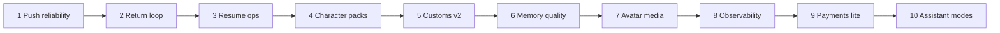

# Procharacters.cloud — v2.2 Roadmap (10 phases)

**Status:** Active  
**Updated:** July 10, 2026  
**Audience:** Gary + builders  
**Where we are:** v2.1+ live on Railway (chat, customs, accounts, multi-device resumes, gallery, export/import, Web Push). **Phase 2 Continue strip shipped.**

---

## Business goal

Turn a working live NSFW chat product into a **reliable, sticky, monetizable** platform — without rewriting the core.

---

## The 10 phases

| # | Phase | Business goal | Deliverables | Rough effort |
|---|--------|----------------|--------------|--------------|
| **1** | Push + expiry reliability | Codes don’t die silently | Phone push smoke checklist, server expiry cron, last-notified in Account | ½–1 day |
| **2** | Return loop polish *(shipped)* | Faster re-entry every visit | Home Continue strip, last-chat one-tap, push→chat deep-link | ½ day |
| **3** | Resume ops pack *(shipping)* | Less panic when codes age | Refresh expiring only, auto-extend on open, QR/print resume card | ½–1 day |
| **4** | Character pack expansion *(shipping)* | More catalog, same product surface | 6 signature models + featured flags (clips interim via avatar_base) | 1–2 days content + light eng |
| **5** | Custom character v2 | Creators stick | Better create UI, clip library, private vs featured, soft limits | 1–2 days |
| **6** | Chat quality + memory | Feels like one ongoing relationship | Longer window options, session notes summary, optional cross-session memory | 1–2 days |
| **7** | Media / avatar upgrade *(shipping)* | Premium video feel | Energy bands, PiP polish, LiveKit ops badge | 1–2 days |
| **8** | Hardening & observability | Sleep at night | Sentry (or similar), structured logs, basic metrics, `/data` backup | 1 day |
| **9** | Payments lite | First revenue | Stripe tip / day-pass / credits; free tier remains | 2–3 days |
| **10** | v3 preview: assistant modes | Brand-defining loop | Optional pace/edge session mode; voice optional spike | 2–4 days spike |

### Dependency sketch

- **Content (4)** can run in parallel with eng **1–3**.
- Don’t start **9** until **8** has basic error visibility.
- **10** is a *preview*, not full v3 gooning product.

---

## Phase detail

### Phase 1 — Push + expiry reliability *(shipping)*

- [x] VAPID keys on Railway API  
- [x] Service worker + Account Enable push  
- [x] Subscribe / check-expiry APIs  
- [x] Server-side cron: scan push subs + notify expiring (hourly by default)  
- [x] Account: last alert time + device count + **Check now**  
- [x] Ops smoke checklist + `scripts/smoke-push-vapid.ts`  
- [ ] Gary: run phone smoke once (see push-smoke-checklist.md)

### Phase 2 — Return loop polish *(shipped)*

- [x] Home / gallery banner: **Continue where you left off** with most recent resume  
- [x] Header + mobile dock primary CTA switches to **Continue** when a resume exists  
- [x] **All my chats** jump from the strip when multiple resumes  
- [x] Push expiry click deep-links to soonest-expiring chat (`/chat?resume=…`) instead of only `/account`  
- [x] Service worker resolves absolute notification URLs on click

### Phase 3 — Resume ops pack *(shipping)*

- [x] Batch refresh only expiring codes  
- [x] Auto-extend resume TTL on every open/resume (sliding window; client shows “code extended”)  
- [x] QR / print-friendly single resume card (Account → **QR / Print** per chat)

### Phase 4 — Character pack expansion *(shipping)*

- [x] 6 signature models (3 twink + 3 female) — prompts + model.json  
- [x] Registry + manifest + live catalog wire-up  
- [x] Featured spotlight: Twink Gym, Female Soft Goth, Female Playful Brat (+ defaults)  
- [ ] Dedicated avatar clips per new model (interim: avatar_base → default packs)

### Phase 5 — Custom character v2 *(shipping)*

- [x] Design: base-of-8, private My Character, scenes + phrases, soft caps  
- [x] Wire: sign-in required, prefill from base, private-only, prompt = base + overlay  
- [x] Clip briefs for 6 Phase 4 models (interim avatar_base remains)  
- [ ] Dedicated filmed packs under `/avatar/<id>/`

### Phase 6 — Chat quality + memory *(shipping)*

- [x] Configurable message window (20/30/50/80) on session start  
- [x] Compact “what we remember” blurb (prompt inject + chat UI + WS)  
- [x] Opt-in cross-session notes for signed-in users (per character)

### Phase 7 — Media / avatar upgrade *(shipping)*

- [x] Expanded energy vocabulary → 4 clip slots + UI bands (idle/tease/play/edge)  
- [x] Avatar energy badge, arousal bar, smoother crossfade  
- [x] PiP mobile safe-area + snap polish  
- [x] LiveKit ops badge (health + chat header)

### Phase 8 — Hardening & observability

- Error tracking (Sentry or equivalent)  
- Structured request logs  
- Volume backup notes for Railway `/data`

### Phase 9 — Payments lite

- Stripe Checkout or Payment Link first  
- Gate optional premium model or higher rate limits  
- Keep free path for demos

### Phase 10 — Assistant modes (v3 preview)

- Session mode flag: normal vs pace/edge tone + timers  
- Not a full real-time assistant product yet  
- Voice = optional spike only

---

## Out of these 10 (later)

- Full social / public profiles  
- Multi-character party chat  
- True generative live video  
- Heavy moderation that fights uncensored brand  

---

## Suggested “next week” order

1. Finish **Phase 1** smoke on phone (Gary)  
2. ~~**Phase 2** Continue strip~~ ✅  
3. **Phase 4** new models (marketing)  
4. **Phase 8** Sentry + backup  
5. **Phase 9** when ready to charge  

---

## Related docs

- [DEPLOY.md](./DEPLOY.md) — Railway + env vars (incl. VAPID)  
- [v2-architecture.md](./v2-architecture.md) — technical stack  
- [v2-planning.md](./v2-planning.md) — original v2 vision  
- [push-smoke-checklist.md](./push-smoke-checklist.md) — Phase 1 phone/ops smoke  

---

*Update this file when a phase ships. Mark checkboxes; bump “Updated” date.*
