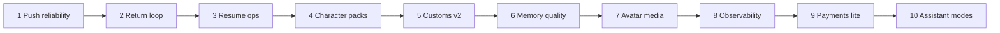

# Procharacters.cloud — v2.2 Roadmap (10 phases)

**Status:** Active  
**Updated:** July 2026  
**Audience:** Gary + builders  
**Where we are:** v2.1+ live on Railway (chat, customs, accounts, multi-device resumes, gallery, export/import, Web Push).

---

## Business goal

Turn a working live NSFW chat product into a **reliable, sticky, monetizable** platform — without rewriting the core.

---

## The 10 phases

| # | Phase | Business goal | Deliverables | Rough effort |
|---|--------|----------------|--------------|--------------|
| **1** | Push + expiry reliability | Codes don’t die silently | Phone push smoke checklist, server expiry cron, last-notified in Account | ½–1 day |
| **2** | Return loop polish | Faster re-entry every visit | Home “Continue where you left off”, last-chat one-tap | ½ day |
| **3** | Resume ops pack | Less panic when codes age | Refresh expiring only *(shipped)*, optional auto-extend on open, QR for one code | ½–1 day |
| **4** | Character pack expansion | More catalog, same product surface | 2–4 signature models + clips + featured | 1–2 days content + light eng |
| **5** | Custom character v2 | Creators stick | Better create UI, clip library, private vs featured, soft limits | 1–2 days |
| **6** | Chat quality + memory | Feels like one ongoing relationship | Longer window options, session notes summary, optional cross-session memory | 1–2 days |
| **7** | Media / avatar upgrade | Premium video feel | More energy states, smoother PiP, clip UX, LiveKit health | 1–2 days |
| **8** | Hardening & observability | Sleep at night | Sentry (or similar), structured logs, basic metrics, `/data` backup | 1 day |
| **9** | Payments lite | First revenue | Stripe tip / day-pass / credits; free tier remains | 2–3 days |
| **10** | v3 preview: assistant modes | Brand-defining loop | Optional pace/edge session mode; voice optional spike | 2–4 days spike |

### Dependency sketch

- **Content (4)** can run in parallel with eng **1–3**.
- Don’t start **9** until **8** has basic error visibility.
- **10** is a *preview*, not full v3 gooning product.

---

## Phase detail

### Phase 1 — Push + expiry reliability *(shipping)*

- [x] VAPID keys on Railway API  
- [x] Service worker + Account Enable push  
- [x] Subscribe / check-expiry APIs  
- [x] Server-side cron: scan push subs + notify expiring (hourly by default)  
- [x] Account: last alert time + device count + **Check now**  
- [x] Ops smoke checklist + `scripts/smoke-push-vapid.ts`  
- [ ] Gary: run phone smoke once (see push-smoke-checklist.md)

### Phase 2 — Return loop polish

- Home / gallery banner: **Continue** with most recent resume  
- Deep-link from push click already → `/account` (improve to last chat when known)

### Phase 3 — Resume ops pack

- [x] Batch refresh only expiring codes  
- Optional: auto-extend TTL when user opens that chat  
- Optional: QR / print-friendly single resume card

### Phase 4 — Character pack expansion

- Registry + prompts + avatar clips only  
- Featured flags for marketing share cards

### Phase 5 — Custom character v2

- Upload UX polish, multi-clip per custom  
- Soft caps (clips, customs per account)

### Phase 6 — Chat quality + memory

- Configurable message window  
- Compact “what we remember” blurb  
- Opt-in cross-session memory for signed-in users

### Phase 7 — Media / avatar upgrade

- More energy states in loops  
- PiP + mobile polish  
- LiveKit configured badge for ops

### Phase 8 — Hardening & observability

- Error tracking (Sentry or equivalent)  
- Structured request logs  
- Volume backup notes for Railway `/data`

### Phase 9 — Payments lite

- Stripe Checkout or Payment Link first  
- Gate optional premium model or higher rate limits  
- Keep free path for demos

### Phase 10 — Assistant modes (v3 preview)

- Session mode flag: normal vs pace/edge tone + timers  
- Not a full real-time assistant product yet  
- Voice = optional spike only

---

## Out of these 10 (later)

- Full social / public profiles  
- Multi-character party chat  
- True generative live video  
- Heavy moderation that fights uncensored brand  

---

## Suggested “next week” order

1. Finish **Phase 1** smoke on phone  
2. **Phase 2** Continue strip  
3. **Phase 4** new models (marketing)  
4. **Phase 8** Sentry + backup  
5. **Phase 9** when ready to charge  

---

## Related docs

- [DEPLOY.md](./DEPLOY.md) — Railway + env vars (incl. VAPID)  
- [v2-architecture.md](./v2-architecture.md) — technical stack  
- [v2-planning.md](./v2-planning.md) — original v2 vision  
- [push-smoke-checklist.md](./push-smoke-checklist.md) — Phase 1 phone/ops smoke  

---

*Update this file when a phase ships. Mark checkboxes; bump “Updated” date.*
